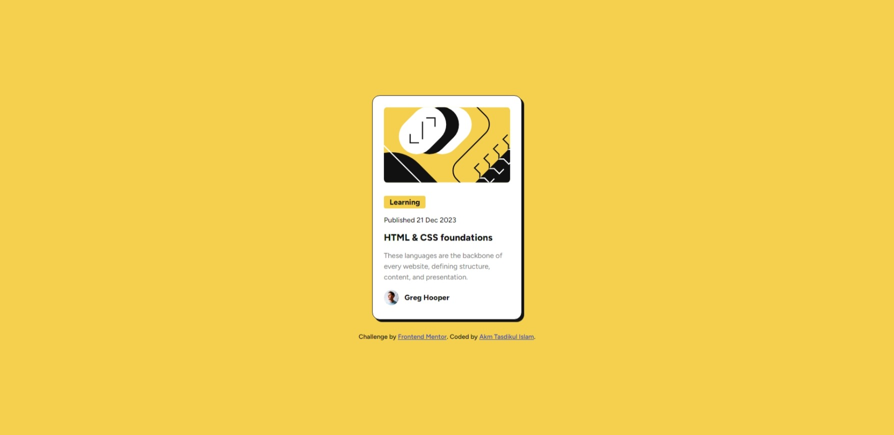
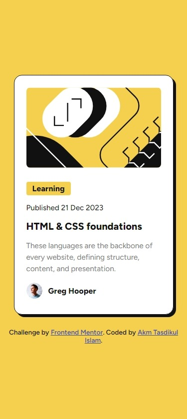

# Frontend Mentor - Blog preview card solution

This is a solution to the [Blog preview card challenge on Frontend Mentor](https://www.frontendmentor.io/challenges/blog-preview-card-ckPaj01IcS). Frontend Mentor challenges help you improve your coding skills by building realistic projects.

## Table of contents

- [Overview](#overview)
  - [The challenge](#the-challenge)
  - [Screenshot](#screenshot)
  - [Links](#links)
- [My process](#my-process)
  - [Built with](#built-with)
  - [What I learned](#what-i-learned)
  - [Useful resources](#useful-resources)
- [Author](#author)

## Overview

- Project Start Date: 28 January 2024
- Project Duration: 1.5 hours

### The challenge

Users should be able to:

- See hover and focus states for all interactive elements on the page

### Screenshot




### Links

- [Solution URL:](https://github.com/akmtasdikulislam/blog-preview-card)
- [Live Site URL:](https://akmtasdikulislam.github.io/blog-preview-card/)

## My process

- At first, I linked the css file and Google Fonts CDN with `index.html`.
- Then copied the color and font instructions given in the `style-guide.md` file.
- After then, I initialized the css file and prepared the `body` _element_ for next step.
- Then I wrote necessary codes (HTML & CSS) to match the given _UI Design Sample_ as close as possible.

### Built with

- Semantic HTML5 markup
- CSS custom properties
- Flexbox
- CSS Grid

### What I learned

By doing this project,

Firstly, I learned how to use box shadow.

```css
box-shadow: [horizontal offset] [vertical offset] [blur radius] [optional spread
  radius] [color];
```

Here:

- **The horizontal offset** (required) of the shadow, positive means the shadow will be on the right of the box, a negative offset will put the shadow on the left of the box.

- **The vertical offset** (required) of the shadow, a negative one means the box-shadow will be above the box, a positive one means the shadow will be below the box.

- **The blur radius** (required), if set to 0 the shadow will be sharp, the higher the number, the more blurred it will be, and the further out the shadow will extend. For instance a shadow with 5px of horizontal offset that also has a 5px blur radius will be 10px of total shadow.

- **The spread radius** (optional), positive values increase the size of the shadow, negative values decrease the size. Default is 0 (the shadow is same size as blur).

- **Color** (required) – takes any color value, like hex, named, rgba or hsla. If the color value is omitted, box shadows are drawn in the foreground color (text color). But be aware, older WebKit browsers (pre Chrome 20 and Safari 6) ignore the rule when color is omitted.

Secondly, I learnt how to use hover states,

```css
/* Card Hover State */
.card:hover {
  box-shadow: 10px 10px 0 var(--black);
}

/* Card Title hover state */
.title:hover {
  color: var(--yellow);
}
```

### Useful resources

- [box-shadow by CSS Tricks](https://css-tricks.com/almanac/properties/b/box-shadow/) - This helped me to add _box-shadow_

## Author

- Frontend Mentor - [@akmtasdikulislam](https://www.frontendmentor.io/profile/akmtasdikulislam)
- Twitter - [@Akm_Tasdikul](https://www.twitter.com/@Akm_Tasdikul)
